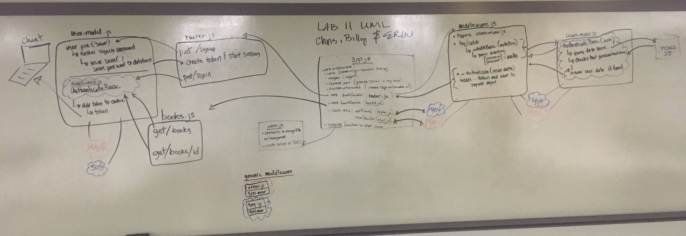

# lab-11

* [Pull Request](https://github.com/401-advanced-javascript-merritt/lab-11/pull/1)
* [Docs](https://merritt-lab11-fixed.herokuapp.com/docs)
* [Heroku](https://merritt-lab11-fixed.herokuapp.com/)
#### Bug fixes:

1. add the app.use(auth) middle ware to app.js
2. in router.js -> changed signin route to a post method from a get
3. middleware.js -> changed encodedString to authString, passed it through function _authBasic(authString)
4. require decript and jwt at users-model.js
5. middleware.js -> set the req.user to user, generated the token.
6. middleware.js -> change line 28 from array into object
7. fix unhandled promise in users-model.js fix un handled promise in users.methods.comparePassword.

* make a new user: `echo '{"username" : "chris", "password":""123"}' | http post :8080/signup`

* sign in: `http post :8080/signin -a chris:123`

* get all books: `http get :8080/books/ -a chris:123`

* get one book at index 2: `http get :8080/books/2 -a chris:123`

